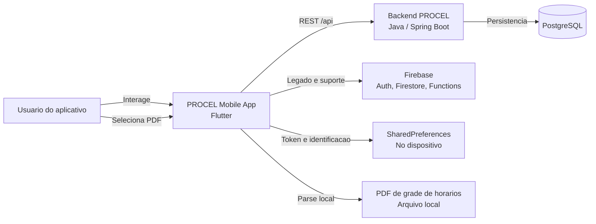
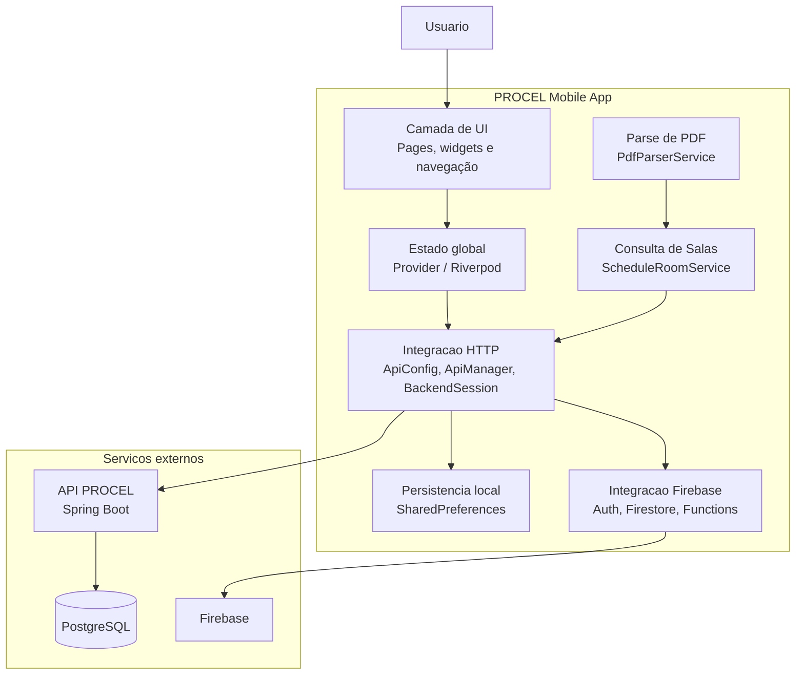
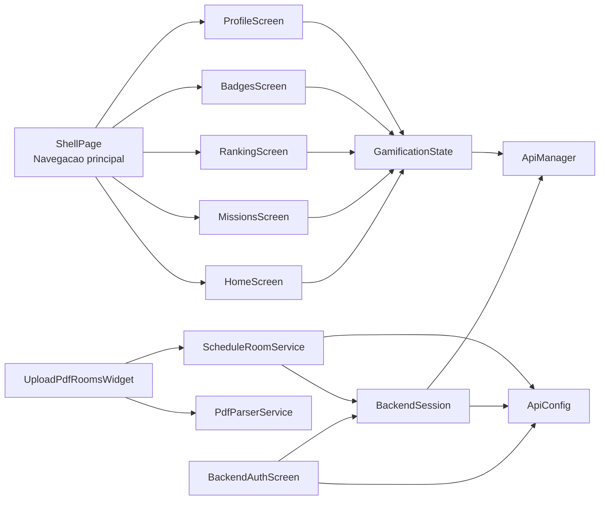
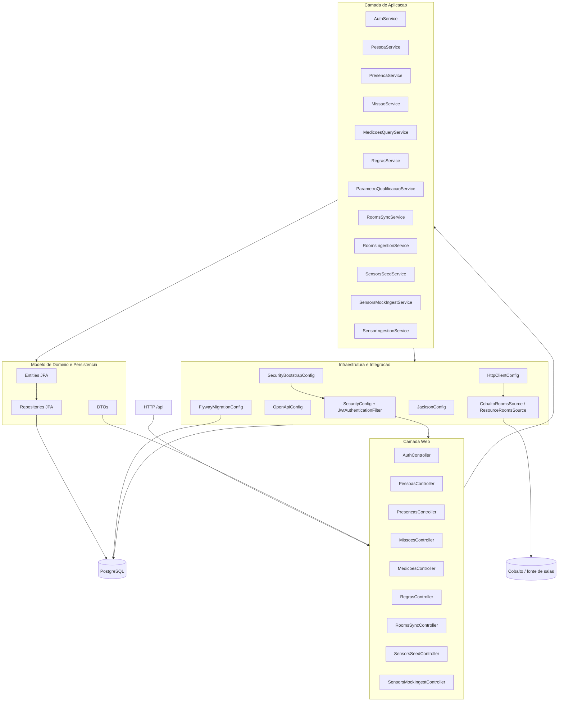

# PROCEL - SDD e C4

## Sumario Executivo

PROCEL e um aplicativo mobile Flutter com foco em experiencia do usuario e gamificacao, integrado a um backend Java/Spring Boot que concentra autenticacao, regras de dominio, ingestao de dados e persistencia em PostgreSQL. O frontend atua como shell de interacao, mantendo estado de UI e acesso a API, enquanto Firebase permanece como apoio para fluxos legados e servicos complementares.

Para apresentacao executiva, a mensagem principal e que a arquitetura foi desenhada para separar claramente interface, integracao e dominio, reduzir acoplamento entre telas e regras de negocio, e permitir evolucao incremental do produto sem quebrar o fluxo atual de autenticacao e operacao.

## 1. Objetivo

Este documento descreve as decisoes de design de software da aplicacao PROCEL e representa sua estrutura em visoes C4. O foco e registrar a arquitetura atual do app novo, preservando o contexto de um frontend Flutter que conversa com um backend Java separado e ainda convive com Firebase para funcionalidades legadas e de suporte.

## 2. Escopo

### Em escopo

- Aplicacao mobile Flutter.
- Integracao com backend Java/Spring Boot via REST.
- Persistencia local de sessao e identificacao do usuario.
- Integracao com Firebase para autenticacao e recursos legados.
- Estrutura de telas, estado global e servicos de dados.
- **Upload e parse de PDF de grade de horarios para mapeamento de salas.**

### Fora de escopo

- Reescrita completa do backend.
- Mudancas de infraestrutura do servidor remoto.
- Redesenho de identidade visual ou produto.

## 3. Visao Geral da Arquitetura

O PROCEL segue uma arquitetura cliente-servidor com responsabilidades bem separadas:

- O app Flutter concentra interface, navegacao, estado de tela e consumo de APIs.
- O backend Java expoe a API principal do dominio e persiste os dados analiticos em PostgreSQL.
- O Firebase permanece como base de suporte para fluxos legados e servicos auxiliares.
- A sessao do usuario e mantida localmente para restauracao automatica do acesso no app.
- **O app realiza parse de PDF de grade de horarios no lado do cliente e consulta salas via endpoints existentes do backend.**

## 4. Principais Decisoes de Design

### 4.1 Flutter como shell de experiencia

O app e tratado como camada de experiencia e orquestracao. A navegacao principal vive no cliente, e as funcionalidades sao compostas a partir de widgets e paginas reutilizaveis.

### 4.2 Separacao entre UI, estado e integracao

A aplicacao separa:

- componentes de interface em `lib/components/`;
- paginas em `lib/pages/`;
- estado global em `lib/services/` e `lib/providers/`;
- integracao de API em `lib/backend/` e `lib/config/`.

Essa separacao reduz acoplamento entre telas e regras de integracao.

### 4.3 Backend como fonte principal de dados de dominio

O backend Java e a fonte principal para autenticacao no novo fluxo e para dados de pessoas, presencas, salas, sensores, medicoes, regras e gamificacao. Isso evita que o app concentre regras de negocio criticas.

### 4.4 Sessao persistida localmente

O token de acesso do backend e persistido em SharedPreferences e restaurado na inicializacao do app. Isso permite manter o usuario autenticado entre execucoes sem exigir novo login a cada abertura.

### 4.5 Configuracao do endpoint por ambiente

A URL base da API pode ser sobrescrita com `--dart-define=API_BASE_URL=...`. Sem definicao explicita, o app usa enderecos locais por plataforma para facilitar desenvolvimento.

### 4.6 Firebase como legada e complementar

Firebase nao e o centro do novo desenho, mas continua no ecossistema para autenticacao, Firestore, Cloud Functions e outros fluxos legados que ainda nao foram totalmente migrados.

### 4.7 Navegacao por shell principal

A area autenticada usa uma navegacao inferior com abas principais de Home, Missoes, Ranking, Badges e Perfil. Isso favorece uma experiencia de uso continua e previsivel.

### 4.8 Parse de PDF no cliente com consulta a endpoints existentes

O parse do PDF de grade de horarios e feito inteiramente no lado do cliente (Flutter) usando `syncfusion_flutter_pdf`. O texto extraido e interpretado como uma tabela (secoes MANHA/TARDE/NOITE, linhas de horario, colunas de dias da semana). As disciplinas extraidas sao entao enviadas para consulta de salas usando **apenas endpoints ja existentes** no backend (`GET /api/pessoas/{id}/disciplinas` e `GET /api/catalog/disciplinas/{id}/periodos-aula`), sem necessidade de criar novos endpoints.

## 5. Estrutura Logica do App

### 5.1 Camada de apresentacao

Responsavel por:

- telas principais;
- shells de navegacao;
- widgets reutilizaveis;
- formularios e feedback visual.
- **widget de upload de PDF e exibicao de resultados de mapeamento de salas.**

### 5.2 Camada de estado

Responsavel por:

- dados globais de gamificacao;
- informacoes do usuario;
- flags e estados compartilhaveis entre telas.

### 5.3 Camada de integracao

Responsavel por:

- chamadas REST para o backend;
- persistencia e restauracao de token;
- configuracao de URLs e timeouts;
- adaptacao de payloads e respostas.
- **parse de PDF e consulta de salas por grade de horarios.**

### 5.4 Camada de dados externos

Inclui:

- backend Java/Spring Boot;
- PostgreSQL;
- Firebase;
- armazenamento local no dispositivo.

## 6. Requisitos Arquiteturais

### Funcionais

- autenticar usuario no backend;
- restaurar sessao automaticamente;
- exibir progresso, missao, ranking e conquistas;
- permitir operacoes de upload e fluxos complementares;
- consumir dados de sensores, salas e presencas quando necessario.
- **fazer upload de PDF de grade de horarios e mapear disciplinas para salas fisicas.**

### Nao funcionais

- manter separacao clara entre UI e integracao;
- facilitar troca de ambiente sem recompilar o app;
- suportar execucao local e ambiente remoto;
- manter compatibilidade com fluxos legados de Firebase;
- reduzir acoplamento entre tela e acesso a API.
- **parse de PDF executado localmente no dispositivo sem depender de servico externo.**

## 7. C4 - Contexto

## 8. C4 - Container

## 9. C4 - Componentes do Mobile

## 10. C4 - Backend detalhado

O backend e o container de dominio e integracao do novo fluxo do PROCEL. Ele expõe a API REST, aplica seguranca JWT stateless, orquestra regras de negocio por modulo funcional e persiste o estado operacional em PostgreSQL com Flyway como mecanismo de migracao.

### 10.1 C4 - Componentes do backend

### 10.2 Responsabilidades do backend

- autenticar usuarios e emitir JWT;
- cadastrar pessoas e administrar permissões por role;
- registrar e consultar presencas;
- sincronizar salas e ingestao de sensores;
- manter catalogo de missoes e atividades;
- avaliar medicoes contra regras de qualificacao;
- publicar Swagger/OpenAPI para integracao e teste.
- **expor endpoints de consulta de disciplinas do aluno e periodos de aula por disciplina (usados pelo ScheduleRoomService).**

### 10.3 Decisoes de design do backend

- API stateless com JWT para reduzir dependencia de sessao no servidor.
- CORS configurado para suportar frontends locais e ambiente publicado.
- Flyway como controle de schema para manter rastreabilidade de banco.
- Spring Security como ponto unico de autorizacao por role e endpoint.
- Separacao entre controllers, services, repositories e integracoes externas.

## 11. Fluxo de Autenticacao

1. O app inicia e restaura o token salvo.
2. A tela de autenticacao decide se o usuario pode seguir para a area interna.
3. O login ou cadastro chama a API Java.
4. O backend retorna access token e identificacao do usuario.
5. O token e gravado localmente e reaplicado ao cliente HTTP.
6. O app abre o shell autenticado com as abas principais.

## 12. Fluxo de Consumo de Dados

1. A tela solicita dados ao estado ou ao servico.
2. A camada de integracao monta a URI via `ApiConfig`.
3. A requisicao e enviada ao backend com cabecalhos JSON padrao.
4. A resposta e normalizada e convertida em modelo de dominio ou estado de UI.
5. O estado global notifica a interface para recomposicao.

## 13. Fluxo de Upload de PDF e Mapeamento de Salas

1. O usuario seleciona um arquivo PDF de grade de horarios via `FilePicker`.
2. O `PdfParserService` extrai o texto do PDF usando `syncfusion_flutter_pdf`.
3. O parser identifica no cabecalho: **matricula** e **periodo letivo** do aluno.
4. O parser interpreta a grade como tabela, identificando secoes (MANHA/TARDE/NOITE), linhas de horario e colunas de dias da semana.
5. As disciplinas sao extraidas no formato `11100059 - T2 - CALCULO 2` e associadas ao dia e horario correspondentes.
6. O `ScheduleRoomService` consulta:
   - `GET /api/pessoas/{matricula}/disciplinas?periodoLetivo=AAAA/S` para obter as disciplinas do aluno.
   - `GET /api/catalog/disciplinas/{id}/periodos-aula` para cada disciplina, obtendo os periodos com sala.
7. O servico faz **match** entre as entradas do PDF e os periodos da API por (disciplinaId, turma, dia da semana, horario).
8. O resultado (mapeamento disciplina -> sala) e exibido ao usuario em um modal.

## 14. Consideracoes de Evolucao

As evolucoes mais provaveis para este desenho sao:

- consolidar a camada de acesso a dados em repositorios mais explicitos;
- reduzir dependencias diretas de widgets sobre servicos de rede;
- formalizar contratos DTO e modelos de dominio;
- separar de forma mais nitida a parte legada Firebase do fluxo principal Java;
- ampliar a documentacao C4 com visao de componentes do backend quando necessario.
- **melhorar o parser de PDF para suportar diferentes formatos de grade de horarios de outras instituicoes.**

## 15. Referencias do Codigo

- Entrada do app: [lib/main.dart](../../lib/main.dart)
- Configuracao da API: [lib/config/api_config.dart](../../lib/config/api_config.dart)
- Sessao do backend: [lib/services/backend_session.dart](../../lib/services/backend_session.dart)
- Parser de PDF: [lib/services/pdf_parser_service.dart](../../lib/services/pdf_parser_service.dart)
- Consulta de salas por grade: [lib/services/schedule_room_service.dart](../../lib/services/schedule_room_service.dart)
- Widget de upload de PDF: [lib/pages/upload_pdf_rooms/upload_pdf_rooms_widget.dart](../../lib/pages/upload_pdf_rooms/upload_pdf_rooms_widget.dart)
- Modelo de entrada de grade: [lib/models/timetable_entry.dart](../../lib/models/timetable_entry.dart)
- Modelo de sala: [lib/models/room_model.dart](../../lib/models/room_model.dart)
- README do app: [README.md](../../README.md)
- Backend Java: [backend-repo/README.md](../../backend-repo/README.md)

## 16. Historico De Decisoes

| Decisao | Motivo |
| --- | --- |
| Flutter como frontend principal | Mantem experiencia mobile multiplataforma e centraliza a interface. |
| Backend Java separado | Isola regras de negocio e persistencia do aplicativo. |
| Token persistido localmente | Evita relogin a cada abertura do app. |
| API configuravel por dart-define | Facilita troca entre local, homologacao e producao. |
| Firebase preservado como legado | Reduz risco de migracao gradual e suporta fluxos existentes. |
| **Parse de PDF no cliente** | **Evita dependencia de servico externo para extracao de texto e reduz latencia.** |
| **Consulta de salas via endpoints existentes** | **Elimina necessidade de criar novos endpoints no backend, reutilizando a API ja disponivel.** |
| **Match por (disciplinaId, turma, dia, horario)** | **Garante precisao no mapeamento entre a grade do PDF e os periodos cadastrados no backend.** |

## 17. Resultado Esperado

Esta documentacao serve como base para evolucoes futuras do app, revisoes de arquitetura e alinhamento entre frontend, backend e infraestrutura. Sempre que a arquitetura mudar, os diagramas C4 e as decisoes de design devem ser atualizados junto com o codigo.